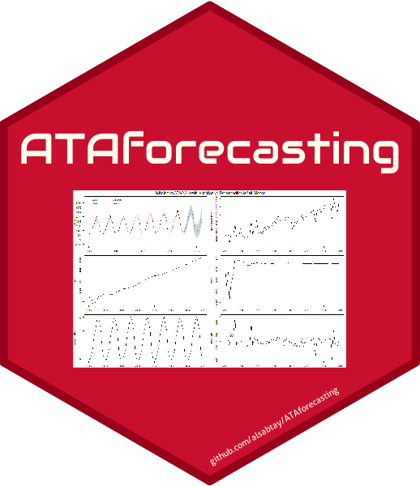

# ATAforecasting 

[](https://cran.r-project.org/package=ATAforecasting)
[](https://cran.r-project.org/package=ATAforecasting)
[](https://www.gnu.org/licenses/gpl-3.0.en.html)

## Synopsis

Automatic Time Series Analysis and Forecasting using Ata Method with Box-Cox Power Transformations Family and Seasonal Decomposition Techniques.

## Description

The Ata Method is a new alternative forecasting method. This method is alternative to two major forecasting approaches: Exponential Smoothing and ARIMA.
The Ata method based on the modified simple exponential smoothing as described in Yapar, G. (2016) [doi:10.15672/HJMS.201614320580](https://doi.org/10.15672/HJMS.201614320580), 
Yapar G., Capar, S., Selamlar, H. T., Yavuz, I. (2017) [doi:10.15672/HJMS.2017.493](https://doi.org/10.15672/HJMS.2017.493) and Yapar G., Selamlar, H. T., Capar, S., Yavuz, I. (2019) 
[doi:10.15672/hujms.461032](https://doi.org/10.15672/hujms.461032) is a new univariate time series forecasting method which provides innovative solutions to issues faced during 
the initialization and optimization stages of existing methods.

Forecasting performance of the Ata method is superior to existing methods both in terms of easy implementation and accurate forecasting. 
It can be applied to non-seasonal or seasonal time series which can be decomposed into four components (remainder, level, trend and seasonal).
This methodology performed well on the M3 and M4-competition dat

## Installation

You can install the **stable** version from
[CRAN](https://cran.r-project.org/package=ATAforecasting):

``` 
install.packages("ATAforecasting")
```

Development version with latest features:
```
devtools::install_github("alsabtay/ATAforecasting")
```

Fable Modelling Wrappers for ATAforecasting Package
```
devtools::install_github("alsabtay/fable.ata")
```

## Example

USAccDeaths: Accidental Deaths in the US 1973--1978

``` r
library(ATAforecasting)
ATA(USAccDeaths, h = 18, model.type = "A", seasonal.type = "A", seasonal.model = "stl")
``` 

## Links

[Github page](https://github.com/alsabtay/ATAforecasting)

[Github.io page](https://alsabtay.github.io/ATAforecasting/)

[Project team website](https://atamethod.wordpress.com/)

[Github - Fable Modelling Wrappers for ATAforecasting Package](https://github.com/alsabtay/fable.ata)

[Github.io - Fable Modelling Wrappers for ATAforecasting Package](https://alsabtay.github.io/fable.ata/index.html)

## License
This package is free and open source software, licensed under GPL-3.
